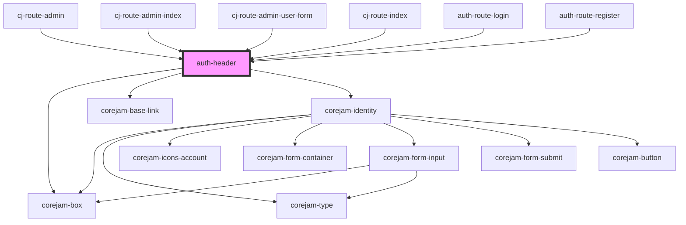

# auth-header

<!-- Auto Generated Below -->

## Dependencies

### Used by

 - [cj-route-admin](../../routes/admin/users)
 - [cj-route-admin-index](../../routes/admin/users)
 - [cj-route-admin-user-form](../../routes/admin/users/edit)
 - [cj-route-index](../../routes)
 - [auth-route-login](../../routes)
 - [auth-route-register](../../routes)

### Depends on

- corejam-box
- corejam-base-link
- [corejam-identity](../Identity)

### Graph

----------------------------------------------

*Built with [StencilJS](https://stenciljs.com/)*
