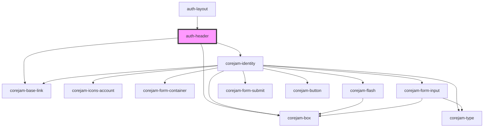

# auth-header

<!-- Auto Generated Below -->

## Dependencies

### Used by

 - [auth-layout](../../layout)

### Depends on

- corejam-box
- corejam-base-link
- [corejam-identity](../Identity)

### Graph

----------------------------------------------

*Built with [StencilJS](https://stenciljs.com/)*
