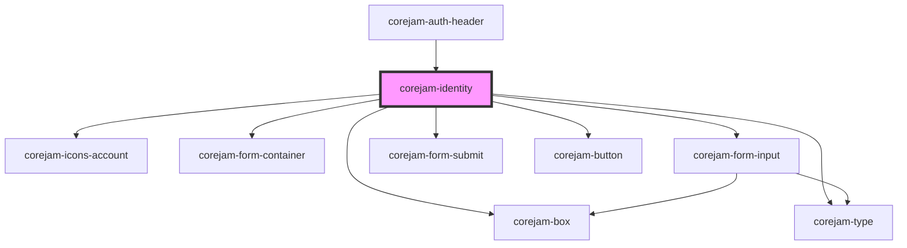

# corejam-identity

<!-- Auto Generated Below -->

## Properties

| Property       | Attribute       | Description | Type     | Default        |
| -------------- | --------------- | ----------- | -------- | -------------- |
| `loginLink`    | `login-link`    |             | `string` | `"/login/"`    |
| `registerLink` | `register-link` |             | `string` | `"/register/"` |

## Dependencies

### Used by

- [corejam-auth-header](../Header)

### Depends on

- corejam-box
- corejam-type
- [corejam-icons-account](../icons/account)
- corejam-form-container
- corejam-form-input
- corejam-form-submit
- corejam-button

### Graph

---

_Built with [StencilJS](https://stenciljs.com/)_
