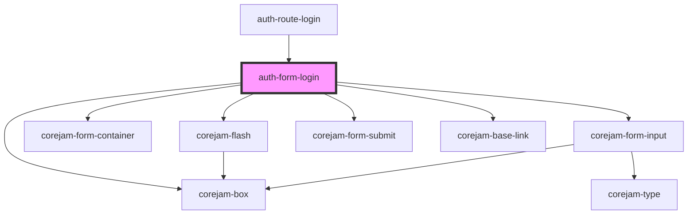

# auth-form-login

<!-- Auto Generated Below -->

## Properties

| Property    | Attribute | Description | Type       | Default     |
| ----------- | --------- | ----------- | ---------- | ----------- |
| `onFail`    | --        |             | `Function` | `undefined` |
| `onSuccess` | --        |             | `Function` | `undefined` |

## Dependencies

### Used by

 - [auth-route-login](../../routes)

### Depends on

- corejam-box
- corejam-flash
- corejam-form-container
- corejam-form-input
- corejam-form-submit
- corejam-base-link

### Graph

----------------------------------------------

*Built with [StencilJS](https://stenciljs.com/)*
