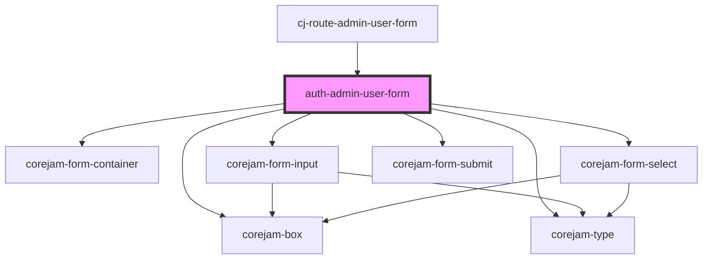

# auth-admin-user-form

<!-- Auto Generated Below -->

## Properties

| Property | Attribute | Description | Type      | Default     |
| -------- | --------- | ----------- | --------- | ----------- |
| `error`  | `error`   |             | `boolean` | `false`     |
| `formId` | `form-id` |             | `string`  | `undefined` |

## Dependencies

### Used by

- [cj-route-admin-user-form](../../routes/admin/users/edit)

### Depends on

- corejam-box
- corejam-type
- corejam-form-container
- corejam-form-input
- corejam-form-select
- corejam-form-submit

### Graph

---

_Built with [StencilJS](https://stenciljs.com/)_
