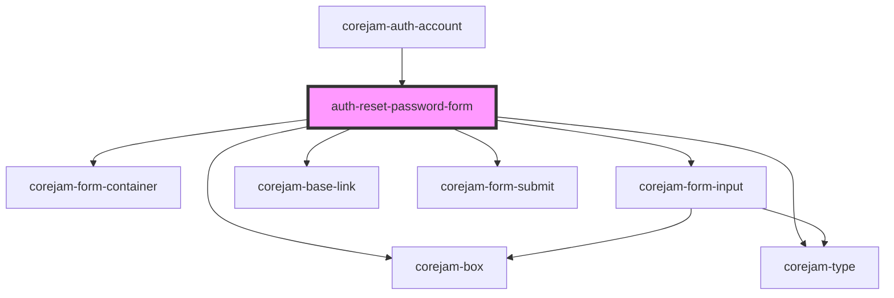

# auth-reset-password-form

<!-- Auto Generated Below -->

## Dependencies

### Used by

- [corejam-auth-account](../auth-account)

### Depends on

- corejam-box
- corejam-type
- corejam-form-container
- corejam-form-input
- corejam-base-link
- corejam-form-submit

### Graph

---

_Built with [StencilJS](https://stenciljs.com/)_
