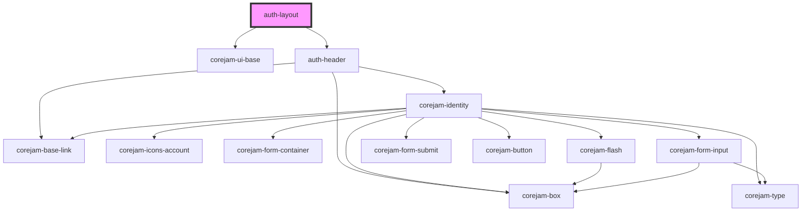

# auth-layout

<!-- Auto Generated Below -->

## Dependencies

### Depends on

- corejam-ui-base
- [auth-header](../components/Header)

### Graph

----------------------------------------------

*Built with [StencilJS](https://stenciljs.com/)*
