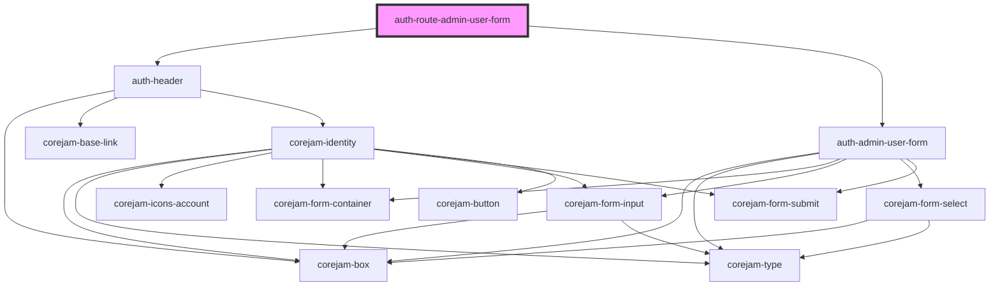

# auth-route-admin-user-form

<!-- Auto Generated Below -->

## Properties

| Property | Attribute | Description | Type  | Default     |
| -------- | --------- | ----------- | ----- | ----------- |
| `param`  | `param`   |             | `any` | `undefined` |

## Dependencies

### Depends on

- [auth-header](../../../../components/Header)
- [auth-admin-user-form](../../../../components/auth-admin-user-form)

### Graph

----------------------------------------------

*Built with [StencilJS](https://stenciljs.com/)*
