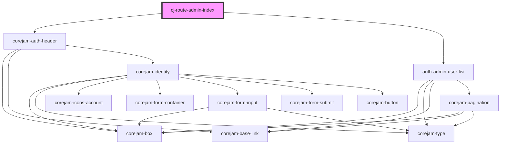

# cj-route-admin

<!-- Auto Generated Below -->

## Dependencies

### Depends on

- [corejam-auth-header](../../../components/Header)
- [auth-admin-user-list](../../../components/auth-admin-user-list)

### Graph

---

_Built with [StencilJS](https://stenciljs.com/)_
