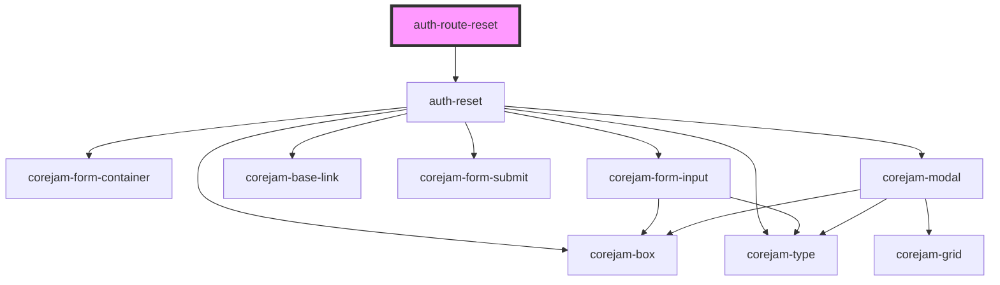

# auth-route-reset

<!-- Auto Generated Below -->

## Dependencies

### Depends on

- [auth-reset](../../components/ResetForm)

### Graph

----------------------------------------------

*Built with [StencilJS](https://stenciljs.com/)*
