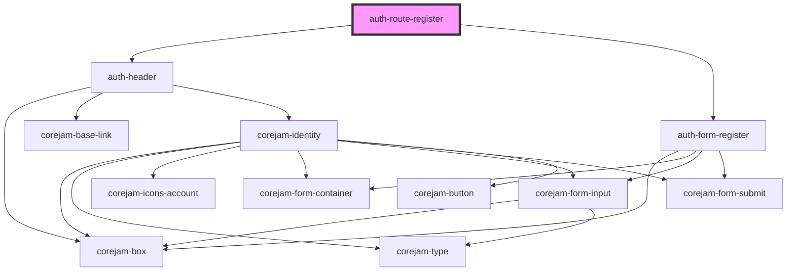

# auth-route-register

<!-- Auto Generated Below -->

## Dependencies

### Depends on

- [auth-header](../components/Header)
- [auth-form-register](../components/auth-form-register)

### Graph

----------------------------------------------

*Built with [StencilJS](https://stenciljs.com/)*
