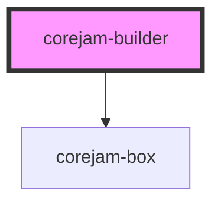

# corejam-builder

<!-- Auto Generated Below -->

## Properties

| Property   | Attribute | Description | Type        | Default |
| ---------- | --------- | ----------- | ----------- | ------- |
| `demo`     | `demo`    |             | `boolean`   | `true`  |
| `draggers` | --        |             | `Dragger[]` | `[]`    |

## Dependencies

### Depends on

- corejam-box

### Graph

----------------------------------------------

*Built with [StencilJS](https://stenciljs.com/)*
