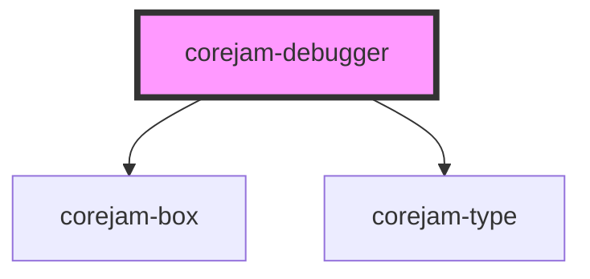

# corejam-debugger

<!-- Auto Generated Below -->

## Properties

| Property  | Attribute | Description | Type  | Default |
| --------- | --------- | ----------- | ----- | ------- |
| `machine` | `machine` |             | `any` | `null`  |

## Dependencies

### Depends on

- corejam-box
- corejam-type

### Graph

----------------------------------------------

*Built with [StencilJS](https://stenciljs.com/)*
