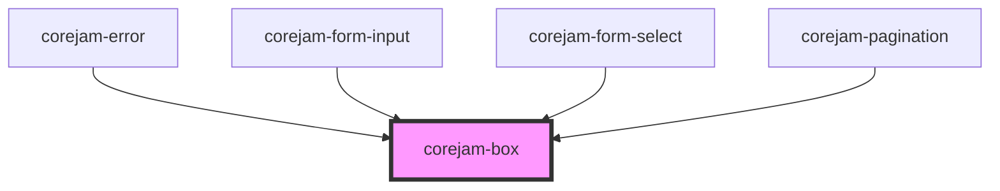

# dershop-ui-box

<!-- Auto Generated Below -->

## Properties

| Property            | Attribute          | Description | Type                                                                | Default                                 |
| ------------------- | ------------------ | ----------- | ------------------------------------------------------------------- | --------------------------------------- |
| `alignContent`      | `align-content`    |             | `"around" \| "between" \| "center" \| "end" \| "start"`             | `undefined`                             |
| `animation`         | `animation`        |             | `string`                                                            | `undefined`                             |
| `bColor`            | `b-color`          |             | `string`                                                            | `undefined`                             |
| `bStyle`            | `b-style`          |             | `string`                                                            | `undefined`                             |
| `bWidth`            | `b-width`          |             | `number`                                                            | `undefined`                             |
| `bWidthBottom`      | `b-width-bottom`   |             | `number`                                                            | `undefined`                             |
| `bWidthLeft`        | `b-width-left`     |             | `number`                                                            | `undefined`                             |
| `bWidthRight`       | `b-width-right`    |             | `number`                                                            | `undefined`                             |
| `bWidthTop`         | `b-width-top`      |             | `number`                                                            | `undefined`                             |
| `basis`             | `basis`            |             | `number`                                                            | `undefined`                             |
| `bg`                | `bg`               |             | `string`                                                            | `undefined`                             |
| `bottom`            | `bottom`           |             | `number`                                                            | `undefined`                             |
| `collapse`          | `collapse`         |             | `"collapse" \| "separate"`                                          | `undefined`                             |
| `direction`         | `direction`        |             | `"col" \| "col-reverse" \| "row" \| "row-reverse"`                  | `undefined`                             |
| `display`           | `display`          |             | `"block" \| "flex" \| "inine" \| "none"`                            | `undefined`                             |
| `droppableElements` | --                 |             | `string[]`                                                          | `["dershop-ui-box", "dershop-ui-grid"]` |
| `flex`              | `flex`             |             | `boolean`                                                           | `undefined`                             |
| `flow`              | `flow`             |             | `"column" \| "column-reverse" \| "row" \| "row-reverse"`            | `undefined`                             |
| `grow`              | `grow`             |             | `number`                                                            | `undefined`                             |
| `h`                 | `h`                |             | `string`                                                            | `undefined`                             |
| `hide`              | `hide`             |             | `boolean`                                                           | `undefined`                             |
| `hoverBg`           | `hover-bg`         |             | `string`                                                            | `undefined`                             |
| `items`             | `items`            |             | `"baseline" \| "center" \| "end" \| "start" \| "stretch"`           | `undefined`                             |
| `justify`           | `justify`          |             | `"around" \| "between" \| "center" \| "end" \| "evenly" \| "start"` | `undefined`                             |
| `left`              | `left`             |             | `number`                                                            | `undefined`                             |
| `lgAlignContent`    | `lg-align-content` |             | `"around" \| "between" \| "center" \| "end" \| "start"`             | `undefined`                             |
| `lgBasis`           | `lg-basis`         |             | `number`                                                            | `undefined`                             |
| `lgBg`              | `lg-bg`            |             | `string`                                                            | `undefined`                             |
| `lgDirection`       | `lg-direction`     |             | `"col" \| "col-reverse" \| "row" \| "row-reverse"`                  | `undefined`                             |
| `lgDisplay`         | `lg-display`       |             | `"block" \| "flex" \| "inine" \| "none"`                            | `undefined`                             |
| `lgFlow`            | `lg-flow`          |             | `"column" \| "column-reverse" \| "row" \| "row-reverse"`            | `undefined`                             |
| `lgGrow`            | `lg-grow`          |             | `number`                                                            | `undefined`                             |
| `lgH`               | `lg-h`             |             | `string`                                                            | `undefined`                             |
| `lgHide`            | `lg-hide`          |             | `boolean`                                                           | `undefined`                             |
| `lgHoverBg`         | `lg-hover-bg`      |             | `string`                                                            | `undefined`                             |
| `lgIitems`          | `lg-iitems`        |             | `"baseline" \| "center" \| "end" \| "start" \| "stretch"`           | `undefined`                             |
| `lgJustify`         | `lg-justify`       |             | `"around" \| "between" \| "center" \| "end" \| "evenly" \| "start"` | `undefined`                             |
| `lgM`               | `lg-m`             |             | `number`                                                            | `undefined`                             |
| `lgMax`             | `lg-max`           |             | `string`                                                            | `undefined`                             |
| `lgMb`              | `lg-mb`            |             | `number`                                                            | `undefined`                             |
| `lgMl`              | `lg-ml`            |             | `number`                                                            | `undefined`                             |
| `lgMr`              | `lg-mr`            |             | `number`                                                            | `undefined`                             |
| `lgMt`              | `lg-mt`            |             | `number`                                                            | `undefined`                             |
| `lgMx`              | `lg-mx`            |             | `string`                                                            | `undefined`                             |
| `lgMy`              | `lg-my`            |             | `number`                                                            | `undefined`                             |
| `lgOrder`           | `lg-order`         |             | `number`                                                            | `undefined`                             |
| `lgP`               | `lg-p`             |             | `number`                                                            | `undefined`                             |
| `lgPb`              | `lg-pb`            |             | `number`                                                            | `undefined`                             |
| `lgPl`              | `lg-pl`            |             | `number`                                                            | `undefined`                             |
| `lgPr`              | `lg-pr`            |             | `number`                                                            | `undefined`                             |
| `lgPt`              | `lg-pt`            |             | `number`                                                            | `undefined`                             |
| `lgPx`              | `lg-px`            |             | `number`                                                            | `undefined`                             |
| `lgPy`              | `lg-py`            |             | `number`                                                            | `undefined`                             |
| `lgSelf`            | `lg-self`          |             | `"auto" \| "center" \| "end" \| "start" \| "stretch"`               | `undefined`                             |
| `lgShow`            | `lg-show`          |             | `string`                                                            | `undefined`                             |
| `lgShrink`          | `lg-shrink`        |             | `number`                                                            | `undefined`                             |
| `lgW`               | `lg-w`             |             | `number \| string`                                                  | `undefined`                             |
| `lgWrap`            | `lg-wrap`          |             | `"no-wrap" \| "wrap" \| "wrap-reverse"`                             | `undefined`                             |
| `m`                 | `m`                |             | `number`                                                            | `undefined`                             |
| `max`               | `max`              |             | `string`                                                            | `undefined`                             |
| `mb`                | `mb`               |             | `number`                                                            | `undefined`                             |
| `mdAlignContent`    | `md-align-content` |             | `"around" \| "between" \| "center" \| "end" \| "start"`             | `undefined`                             |
| `mdBasis`           | `md-basis`         |             | `number`                                                            | `undefined`                             |
| `mdBg`              | `md-bg`            |             | `string`                                                            | `undefined`                             |
| `mdDirection`       | `md-direction`     |             | `"col" \| "col-reverse" \| "row" \| "row-reverse"`                  | `undefined`                             |
| `mdDisplay`         | `md-display`       |             | `"block" \| "flex" \| "inine" \| "none"`                            | `undefined`                             |
| `mdFlow`            | `md-flow`          |             | `"column" \| "column-reverse" \| "row" \| "row-reverse"`            | `undefined`                             |
| `mdGrow`            | `md-grow`          |             | `number`                                                            | `undefined`                             |
| `mdH`               | `md-h`             |             | `string`                                                            | `undefined`                             |
| `mdHide`            | `md-hide`          |             | `boolean`                                                           | `undefined`                             |
| `mdHoverBg`         | `md-hover-bg`      |             | `string`                                                            | `undefined`                             |
| `mdItems`           | `md-items`         |             | `"baseline" \| "center" \| "end" \| "start" \| "stretch"`           | `undefined`                             |
| `mdJustify`         | `md-justify`       |             | `"around" \| "between" \| "center" \| "end" \| "evenly" \| "start"` | `undefined`                             |
| `mdM`               | `md-m`             |             | `number`                                                            | `undefined`                             |
| `mdMax`             | `md-max`           |             | `string`                                                            | `undefined`                             |
| `mdMb`              | `md-mb`            |             | `number`                                                            | `undefined`                             |
| `mdMl`              | `md-ml`            |             | `number`                                                            | `undefined`                             |
| `mdMr`              | `md-mr`            |             | `number`                                                            | `undefined`                             |
| `mdMt`              | `md-mt`            |             | `number`                                                            | `undefined`                             |
| `mdMx`              | `md-mx`            |             | `string`                                                            | `undefined`                             |
| `mdMy`              | `md-my`            |             | `number`                                                            | `undefined`                             |
| `mdOrder`           | `md-order`         |             | `number`                                                            | `undefined`                             |
| `mdP`               | `md-p`             |             | `number`                                                            | `undefined`                             |
| `mdPb`              | `md-pb`            |             | `number`                                                            | `undefined`                             |
| `mdPl`              | `md-pl`            |             | `number`                                                            | `undefined`                             |
| `mdPr`              | `md-pr`            |             | `number`                                                            | `undefined`                             |
| `mdPt`              | `md-pt`            |             | `number`                                                            | `undefined`                             |
| `mdPx`              | `md-px`            |             | `number`                                                            | `undefined`                             |
| `mdPy`              | `md-py`            |             | `number`                                                            | `undefined`                             |
| `mdSelf`            | `md-self`          |             | `"auto" \| "center" \| "end" \| "start" \| "stretch"`               | `undefined`                             |
| `mdShow`            | `md-show`          |             | `string`                                                            | `undefined`                             |
| `mdShrink`          | `md-shrink`        |             | `number`                                                            | `undefined`                             |
| `mdW`               | `md-w`             |             | `number \| string`                                                  | `undefined`                             |
| `mdWrap`            | `md-wrap`          |             | `"no-wrap" \| "wrap" \| "wrap-reverse"`                             | `undefined`                             |
| `minH`              | `min-h`            |             | `string`                                                            | `undefined`                             |
| `ml`                | `ml`               |             | `number`                                                            | `undefined`                             |
| `mr`                | `mr`               |             | `number`                                                            | `undefined`                             |
| `mt`                | `mt`               |             | `number`                                                            | `undefined`                             |
| `mx`                | `mx`               |             | `string`                                                            | `undefined`                             |
| `my`                | `my`               |             | `number`                                                            | `undefined`                             |
| `order`             | `order`            |             | `number`                                                            | `undefined`                             |
| `p`                 | `p`                |             | `number`                                                            | `undefined`                             |
| `pb`                | `pb`               |             | `number`                                                            | `undefined`                             |
| `pl`                | `pl`               |             | `number`                                                            | `undefined`                             |
| `position`          | `position`         |             | `"absolute" \| "fixed" \| "relative" \| "static" \| "sticky"`       | `undefined`                             |
| `pr`                | `pr`               |             | `number`                                                            | `undefined`                             |
| `pt`                | `pt`               |             | `number`                                                            | `undefined`                             |
| `px`                | `px`               |             | `number`                                                            | `undefined`                             |
| `py`                | `py`               |             | `number`                                                            | `undefined`                             |
| `right`             | `right`            |             | `number`                                                            | `undefined`                             |
| `rounded`           | `rounded`          |             | `string`                                                            | `undefined`                             |
| `roundedBottom`     | `rounded-bottom`   |             | `string`                                                            | `undefined`                             |
| `roundedLeft`       | `rounded-left`     |             | `string`                                                            | `undefined`                             |
| `roundedRight`      | `rounded-right`    |             | `string`                                                            | `undefined`                             |
| `roundedTop`        | `rounded-top`      |             | `string`                                                            | `undefined`                             |
| `self`              | `self`             |             | `"auto" \| "center" \| "end" \| "start" \| "stretch"`               | `undefined`                             |
| `shadow`            | `shadow`           |             | `string`                                                            | `undefined`                             |
| `show`              | `show`             |             | `string`                                                            | `undefined`                             |
| `shrink`            | `shrink`           |             | `number`                                                            | `undefined`                             |
| `smAlignContent`    | `sm-align-content` |             | `"around" \| "between" \| "center" \| "end" \| "start"`             | `undefined`                             |
| `smBasis`           | `sm-basis`         |             | `number`                                                            | `undefined`                             |
| `smBg`              | `sm-bg`            |             | `string`                                                            | `undefined`                             |
| `smDirection`       | `sm-direction`     |             | `"col" \| "col-reverse" \| "row" \| "row-reverse"`                  | `undefined`                             |
| `smDisplay`         | `sm-display`       |             | `"block" \| "flex" \| "inine" \| "none"`                            | `undefined`                             |
| `smFlow`            | `sm-flow`          |             | `"column" \| "column-reverse" \| "row" \| "row-reverse"`            | `undefined`                             |
| `smGrow`            | `sm-grow`          |             | `number`                                                            | `undefined`                             |
| `smH`               | `sm-h`             |             | `string`                                                            | `undefined`                             |
| `smHide`            | `sm-hide`          |             | `boolean`                                                           | `undefined`                             |
| `smHoverBg`         | `sm-hover-bg`      |             | `string`                                                            | `undefined`                             |
| `smItems`           | `sm-items`         |             | `"baseline" \| "center" \| "end" \| "start" \| "stretch"`           | `undefined`                             |
| `smJustify`         | `sm-justify`       |             | `"around" \| "between" \| "center" \| "end" \| "evenly" \| "start"` | `undefined`                             |
| `smM`               | `sm-m`             |             | `number`                                                            | `undefined`                             |
| `smMax`             | `sm-max`           |             | `string`                                                            | `undefined`                             |
| `smMb`              | `sm-mb`            |             | `number`                                                            | `undefined`                             |
| `smMl`              | `sm-ml`            |             | `number`                                                            | `undefined`                             |
| `smMr`              | `sm-mr`            |             | `number`                                                            | `undefined`                             |
| `smMt`              | `sm-mt`            |             | `number`                                                            | `undefined`                             |
| `smMx`              | `sm-mx`            |             | `string`                                                            | `undefined`                             |
| `smMy`              | `sm-my`            |             | `number`                                                            | `undefined`                             |
| `smOrder`           | `sm-order`         |             | `number`                                                            | `undefined`                             |
| `smP`               | `sm-p`             |             | `number`                                                            | `undefined`                             |
| `smPb`              | `sm-pb`            |             | `number`                                                            | `undefined`                             |
| `smPl`              | `sm-pl`            |             | `number`                                                            | `undefined`                             |
| `smPr`              | `sm-pr`            |             | `number`                                                            | `undefined`                             |
| `smPt`              | `sm-pt`            |             | `number`                                                            | `undefined`                             |
| `smPx`              | `sm-px`            |             | `number`                                                            | `undefined`                             |
| `smPy`              | `sm-py`            |             | `number`                                                            | `undefined`                             |
| `smSelf`            | `sm-self`          |             | `"auto" \| "center" \| "end" \| "start" \| "stretch"`               | `undefined`                             |
| `smShow`            | `sm-show`          |             | `string`                                                            | `undefined`                             |
| `smShrink`          | `sm-shrink`        |             | `number`                                                            | `undefined`                             |
| `smW`               | `sm-w`             |             | `number \| string`                                                  | `undefined`                             |
| `smWrap`            | `sm-wrap`          |             | `"no-wrap" \| "wrap" \| "wrap-reverse"`                             | `undefined`                             |
| `top`               | `top`              |             | `number`                                                            | `undefined`                             |
| `w`                 | `w`                |             | `number \| string`                                                  | `undefined`                             |
| `wrap`              | `wrap`             |             | `"no-wrap" \| "wrap" \| "wrap-reverse"`                             | `undefined`                             |
| `xlAlignContent`    | `xl-align-content` |             | `"around" \| "between" \| "center" \| "end" \| "start"`             | `undefined`                             |
| `xlBasis`           | `xl-basis`         |             | `number`                                                            | `undefined`                             |
| `xlBg`              | `xl-bg`            |             | `string`                                                            | `undefined`                             |
| `xlDirection`       | `xl-direction`     |             | `"col" \| "col-reverse" \| "row" \| "row-reverse"`                  | `undefined`                             |
| `xlDisplay`         | `xl-display`       |             | `"block" \| "flex" \| "inine" \| "none"`                            | `undefined`                             |
| `xlFlow`            | `xl-flow`          |             | `"column" \| "column-reverse" \| "row" \| "row-reverse"`            | `undefined`                             |
| `xlGrow`            | `xl-grow`          |             | `number`                                                            | `undefined`                             |
| `xlH`               | `xl-h`             |             | `string`                                                            | `undefined`                             |
| `xlHide`            | `xl-hide`          |             | `boolean`                                                           | `undefined`                             |
| `xlHoverBg`         | `xl-hover-bg`      |             | `string`                                                            | `undefined`                             |
| `xlItems`           | `xl-items`         |             | `"baseline" \| "center" \| "end" \| "start" \| "stretch"`           | `undefined`                             |
| `xlM`               | `xl-m`             |             | `number`                                                            | `undefined`                             |
| `xlMax`             | `xl-max`           |             | `string`                                                            | `undefined`                             |
| `xlMb`              | `xl-mb`            |             | `number`                                                            | `undefined`                             |
| `xlMl`              | `xl-ml`            |             | `number`                                                            | `undefined`                             |
| `xlMr`              | `xl-mr`            |             | `number`                                                            | `undefined`                             |
| `xlMt`              | `xl-mt`            |             | `number`                                                            | `undefined`                             |
| `xlMx`              | `xl-mx`            |             | `string`                                                            | `undefined`                             |
| `xlMy`              | `xl-my`            |             | `number`                                                            | `undefined`                             |
| `xlOrder`           | `xl-order`         |             | `number`                                                            | `undefined`                             |
| `xlP`               | `xl-p`             |             | `number`                                                            | `undefined`                             |
| `xlPb`              | `xl-pb`            |             | `number`                                                            | `undefined`                             |
| `xlPl`              | `xl-pl`            |             | `number`                                                            | `undefined`                             |
| `xlPr`              | `xl-pr`            |             | `number`                                                            | `undefined`                             |
| `xlPt`              | `xl-pt`            |             | `number`                                                            | `undefined`                             |
| `xlPx`              | `xl-px`            |             | `number`                                                            | `undefined`                             |
| `xlPy`              | `xl-py`            |             | `number`                                                            | `undefined`                             |
| `xlSelf`            | `xl-self`          |             | `"auto" \| "center" \| "end" \| "start" \| "stretch"`               | `undefined`                             |
| `xlShow`            | `xl-show`          |             | `string`                                                            | `undefined`                             |
| `xlShrink`          | `xl-shrink`        |             | `number`                                                            | `undefined`                             |
| `xlW`               | `xl-w`             |             | `number \| string`                                                  | `undefined`                             |
| `xlWrap`            | `xl-wrap`          |             | `"no-wrap" \| "wrap" \| "wrap-reverse"`                             | `undefined`                             |
| `xljustify`         | `xljustify`        |             | `"around" \| "between" \| "center" \| "end" \| "evenly" \| "start"` | `undefined`                             |
| `z`                 | `z`                |             | `number`                                                            | `undefined`                             |

## Slots

| Slot        | Description                   |
| ----------- | ----------------------------- |
| `"default"` | The box content. \| Type: any |

## Dependencies

### Used by

 - [corejam-error](../Error)
 - [corejam-form-input](../FormInput)
 - [corejam-form-select](../FormSelect)
 - [corejam-pagination](../Pagination)

### Graph

----------------------------------------------

*Built with [StencilJS](https://stenciljs.com/)*
