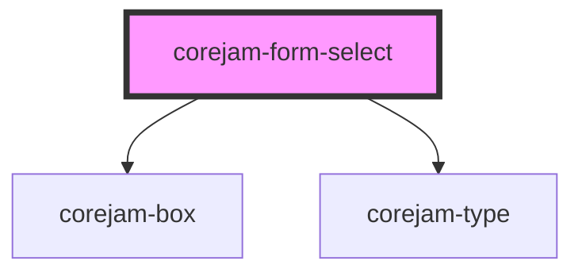

# corejam-form-select

<!-- Auto Generated Below -->

## Properties

| Property   | Attribute  | Description | Type        | Default     |
| ---------- | ---------- | ----------- | ----------- | ----------- |
| `formId`   | `form-id`  |             | `string`    | `undefined` |
| `label`    | `label`    |             | `string`    | `undefined` |
| `multiple` | `multiple` |             | `boolean`   | `false`     |
| `name`     | `name`     |             | `string`    | `undefined` |
| `options`  | --         |             | `options[]` | `undefined` |
| `selected` | `selected` |             | `any`       | `undefined` |

## Events

| Event       | Description | Type               |
| ----------- | ----------- | ------------------ |
| `formEvent` |             | `CustomEvent<any>` |

## Dependencies

### Depends on

- [corejam-box](../Box)
- [corejam-type](../Type)

### Graph

---

_Built with [StencilJS](https://stenciljs.com/)_
