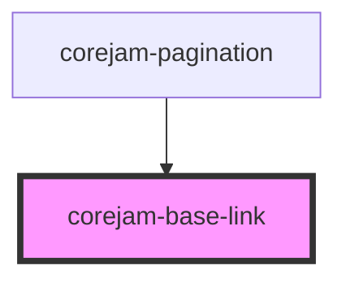

# dershop-base-link

<!-- Auto Generated Below -->

## Properties

| Property          | Attribute          | Description | Type                                                                      | Default                        |
| ----------------- | ------------------ | ----------- | ------------------------------------------------------------------------- | ------------------------------ |
| `color`           | `color`            |             | `string`                                                                  | `"--cj-color-primary"`         |
| `decoration`      | `decoration`       |             | `"--cj-link-decoration" \| "line-through" \| "none" \| "underline"`       | `"--cj-link-decoration"`       |
| `hoverColor`      | `hover-color`      |             | `string`                                                                  | `"--cj-color-secondary"`       |
| `hoverDecoration` | `hover-decoration` |             | `"--cj-link-hover-decoration" \| "line-through" \| "none" \| "underline"` | `"--cj-link-hover-decoration"` |
| `href`            | `href`             |             | `string`                                                                  | `undefined`                    |

## Events

| Event         | Description | Type               |
| ------------- | ----------- | ------------------ |
| `routeChange` |             | `CustomEvent<any>` |

## Dependencies

### Used by

 - [corejam-pagination](../Pagination)

### Graph

----------------------------------------------

*Built with [StencilJS](https://stenciljs.com/)*
