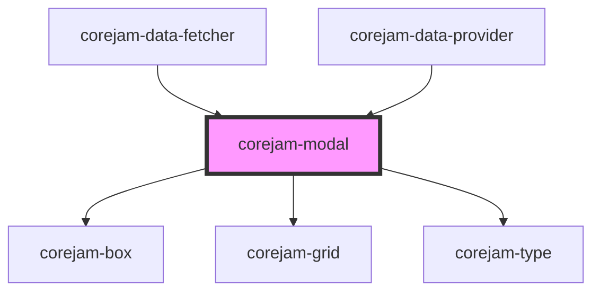

# corejam-modal

<!-- Auto Generated Below -->

## Properties

| Property  | Attribute | Description | Type                                | Default     |
| --------- | --------- | ----------- | ----------------------------------- | ----------- |
| `message` | `message` |             | `string`                            | `undefined` |
| `type`    | `type`    |             | `"error" \| "success" \| "warning"` | `"success"` |

## Events

| Event                 | Description | Type               |
| --------------------- | ----------- | ------------------ |
| `corejam:modal:close` |             | `CustomEvent<any>` |

## Dependencies

### Used by

 - [corejam-data-fetcher](../Data)
 - [corejam-data-provider](../Data)

### Depends on

- [corejam-box](../Box)
- [corejam-grid](../Grid)
- [corejam-type](../Type)

### Graph

----------------------------------------------

*Built with [StencilJS](https://stenciljs.com/)*
