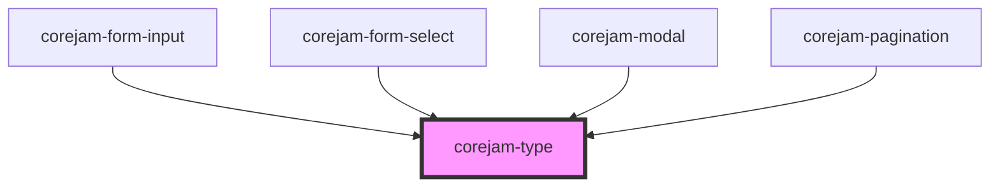

# corejam-type

<!-- Auto Generated Below -->

## Properties

| Property            | Attribute         | Description | Type                                                                                                       | Default           |
| ------------------- | ----------------- | ----------- | ---------------------------------------------------------------------------------------------------------- | ----------------- |
| `align`             | `align`           |             | `"center" \| "left" \| "right"`                                                                            | `undefined`       |
| `as`                | `as`              |             | `"b" \| "h1" \| "h2" \| "h3" \| "h4" \| "h5" \| "h6" \| "i" \| "p" \| "span"`                              | `"span"`          |
| `color`             | `color`           |             | `string`                                                                                                   | `undefined`       |
| `decoration`        | `decoration`      |             | `"line-through" \| "no-underline" \| "underline"`                                                          | `undefined`       |
| `droppableElements` | --                |             | `string[]`                                                                                                 | `["corejam-box"]` |
| `family`            | `family`          |             | `"mono" \| "sans" \| "serif"`                                                                              | `undefined`       |
| `fontStyle`         | `font-style`      |             | `"italic" \| "not-italic"`                                                                                 | `undefined`       |
| `lgFocusWeight`     | `lg-focus-weight` |             | `string`                                                                                                   | `undefined`       |
| `lineHeight`        | `line-height`     |             | `"loose" \| "none" \| "normal" \| "relaxed" \| "snug" \| "tight" \| 10 \| 3 \| 4 \| 5 \| 6 \| 7 \| 8 \| 9` | `undefined`       |
| `mdWeight`          | `md-weight`       |             | `"black" \| "bold" \| "extrabold" \| "hairline" \| "medium" \| "normal" \| "semibold" \| "thin"`           | `undefined`       |
| `size`              | `size`            |             | `"2xl" \| "3xl" \| "4xl" \| "5xl" \| "6xl" \| "base" \| "lg" \| "sm" \| "xl" \| "xs"`                      | `undefined`       |
| `smooth`            | `smooth`          |             | `"antialiased" \| "subpixel-antialiased"`                                                                  | `undefined`       |
| `spacing`           | `spacing`         |             | `"normal" \| "tight" \| "tighter" \| "wide" \| "wider" \| "widest"`                                        | `undefined`       |
| `textStyle`         | `text-style`      |             | `string`                                                                                                   | `undefined`       |
| `transform`         | `transform`       |             | `"capitalize" \| "lowercase" \| "normal-case" \| "uppercase"`                                              | `undefined`       |
| `weight`            | `weight`          |             | `"black" \| "bold" \| "extrabold" \| "hairline" \| "medium" \| "normal" \| "semibold" \| "thin"`           | `undefined`       |

## Dependencies

### Used by

 - [corejam-form-input](../FormInput)
 - [corejam-form-select](../FormSelect)
 - [corejam-modal](../Modal)
 - [corejam-pagination](../Pagination)

### Graph

----------------------------------------------

*Built with [StencilJS](https://stenciljs.com/)*
