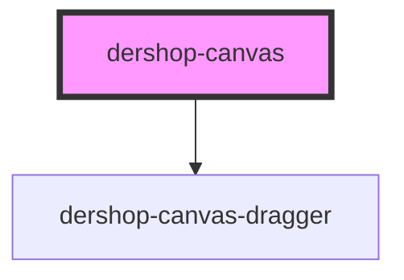

# dershop-canvas

<!-- Auto Generated Below -->

## Properties

| Property   | Attribute   | Description | Type                 | Default                                 |
| ---------- | ----------- | ----------- | -------------------- | --------------------------------------- |
| `canvas`   | `canvas`    |             | `any`                | `undefined`                             |
| `canvasId` | `canvas-id` |             | `string`             | `undefined`                             |
| `draggers` | `draggers`  |             | `string \| string[]` | `["dershop-ui-box", "dershop-ui-type"]` |
| `editMode` | `edit-mode` |             | `boolean`            | `false`                                 |

## Events

| Event         | Description | Type               |
| ------------- | ----------- | ------------------ |
| `p2pSendData` |             | `CustomEvent<any>` |

## Methods

### `addDragger(newDragger: string) => Promise<void>`

#### Returns

Type: `Promise<void>`

## Dependencies

### Depends on

- [dershop-canvas-dragger](../dershop-canvas-dragger)

### Graph

----------------------------------------------

*Built with [StencilJS](https://stenciljs.com/)*
