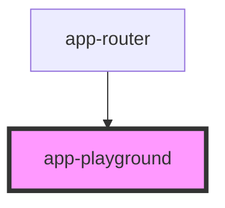

# app-playground

<!-- Auto Generated Below -->

## Properties

| Property | Attribute | Description | Type     | Default     |
| -------- | --------- | ----------- | -------- | ----------- |
| `cmp`    | `cmp`     |             | `string` | `undefined` |
| `data`   | `data`    |             | `any`    | `undefined` |

## Dependencies

### Used by

 - [app-router](../Router)

### Graph

----------------------------------------------

*Built with [StencilJS](https://stenciljs.com/)*
