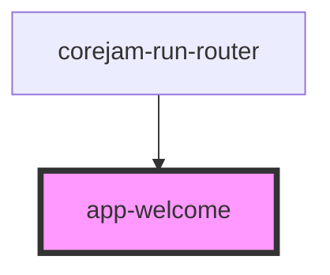

# app-welcome

<!-- Auto Generated Below -->

## Properties

| Property     | Attribute    | Description | Type     | Default     |
| ------------ | ------------ | ----------- | -------- | ----------- |
| `components` | `components` |             | `any`    | `undefined` |
| `mode`       | `mode`       |             | `string` | `undefined` |
| `routes`     | `routes`     |             | `any`    | `undefined` |

## Dependencies

### Used by

 - corejam-run-router

### Graph

----------------------------------------------

*Built with [StencilJS](https://stenciljs.com/)*
