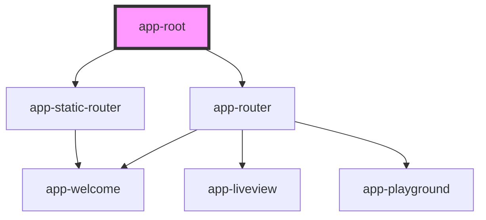

# app-root

<!-- Auto Generated Below -->

## Properties

| Property | Attribute | Description | Type      | Default |
| -------- | --------- | ----------- | --------- | ------- |
| `static` | `static`  |             | `boolean` | `false` |

## Dependencies

### Depends on

- [app-static-router](../StaticRouter)
- [app-router](../Router)

### Graph

----------------------------------------------

*Built with [StencilJS](https://stenciljs.com/)*
