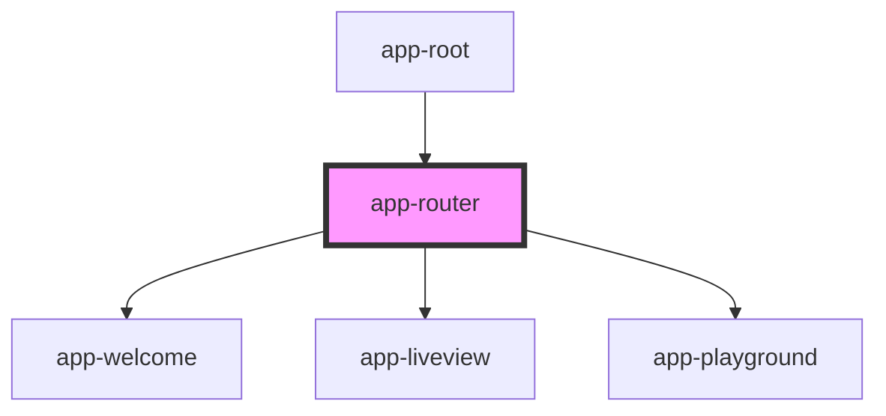

# app-router

<!-- Auto Generated Below -->

## Properties

| Property | Attribute | Description | Type     | Default     |
| -------- | --------- | ----------- | -------- | ----------- |
| `docs`   | `docs`    |             | `any`    | `undefined` |
| `mode`   | `mode`    |             | `string` | `undefined` |
| `routes` | `routes`  |             | `any`    | `undefined` |

## Dependencies

### Used by

 - [app-root](../App)

### Depends on

- [app-welcome](../Welcome)
- [app-liveview](../Liveview)
- [app-playground](../Playground)

### Graph

----------------------------------------------

*Built with [StencilJS](https://stenciljs.com/)*
