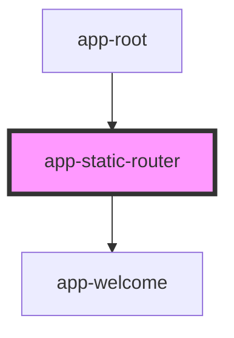

# app-static-router

<!-- Auto Generated Below -->

## Properties

| Property | Attribute | Description | Type  | Default     |
| -------- | --------- | ----------- | ----- | ----------- |
| `docs`   | `docs`    |             | `any` | `undefined` |
| `routes` | `routes`  |             | `any` | `undefined` |

## Dependencies

### Used by

 - [app-root](../App)

### Depends on

- [app-welcome](../Welcome)

### Graph

----------------------------------------------

*Built with [StencilJS](https://stenciljs.com/)*
