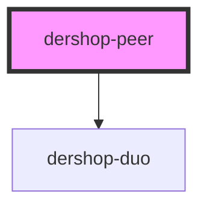

# dershop-peer

<!-- Auto Generated Below -->

## Properties

| Property   | Attribute   | Description | Type     | Default     |
| ---------- | ----------- | ----------- | -------- | ----------- |
| `canvasId` | `canvas-id` |             | `string` | `undefined` |
| `inviteId` | `invite-id` |             | `string` | `undefined` |

## Events

| Event             | Description | Type               |
| ----------------- | ----------- | ------------------ |
| `p2pDisconnected` |             | `CustomEvent<any>` |
| `p2pEstablished`  |             | `CustomEvent<any>` |
| `p2pReceivedData` |             | `CustomEvent<any>` |

## Dependencies

### Depends on

- [dershop-duo](../dershop-duo)

### Graph

---

_Built with [StencilJS](https://stenciljs.com/)_
