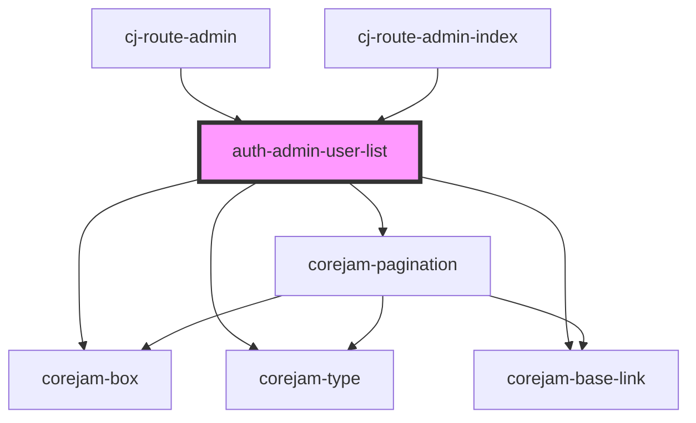

# auth-admin-user-list

<!-- Auto Generated Below -->

## Properties

| Property | Attribute | Description | Type     | Default     |
| -------- | --------- | ----------- | -------- | ----------- |
| `data`   | `data`    |             | `any`    | `undefined` |
| `page`   | `page`    |             | `number` | `undefined` |

## Dependencies

### Used by

 - [cj-route-admin](../../routes/admin/users)
 - [cj-route-admin-index](../../routes/admin/users)

### Depends on

- corejam-box
- corejam-type
- corejam-base-link
- corejam-pagination

### Graph

----------------------------------------------

*Built with [StencilJS](https://stenciljs.com/)*
