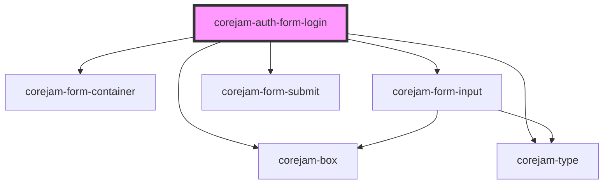

# corejam-auth-form-login

<!-- Auto Generated Below -->

## Properties

| Property | Attribute | Description | Type      | Default |
| -------- | --------- | ----------- | --------- | ------- |
| `error`  | `error`   |             | `boolean` | `false` |

## Dependencies

### Depends on

- corejam-box
- corejam-type
- corejam-form-container
- corejam-form-input
- corejam-form-submit

### Graph

----------------------------------------------

*Built with [StencilJS](https://stenciljs.com/)*
