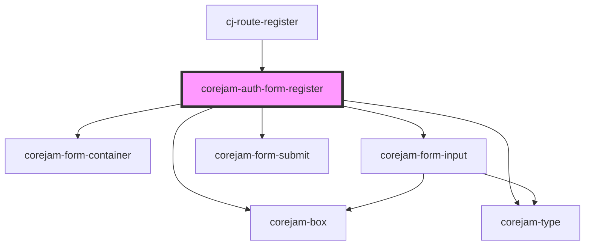

# corejam-auth-form-register

<!-- Auto Generated Below -->

## Dependencies

### Used by

 - [cj-route-register](../../routes)

### Depends on

- corejam-box
- corejam-type
- corejam-form-container
- corejam-form-input
- corejam-form-submit

### Graph

----------------------------------------------

*Built with [StencilJS](https://stenciljs.com/)*
