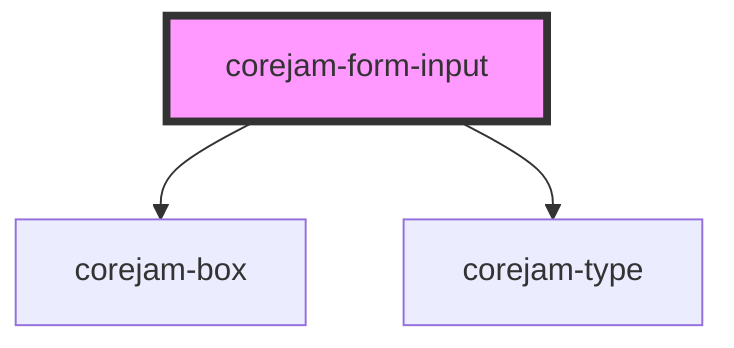

# dershop-form-input

<!-- Auto Generated Below -->

## Properties

| Property       | Attribute       | Description         | Type               | Default      |
| -------------- | --------------- | ------------------- | ------------------ | ------------ |
| `autocomplete` | `autocomplete`  |                     | `string`           | `"off"`      |
| `autofocus`    | `autofocus`     |                     | `boolean`          | `false`      |
| `bWidth`       | `b-width`       |                     | `number`           | `0`          |
| `bg`           | `bg`            |                     | `string`           | `"gray-100"` |
| `checked`      | `checked`       |                     | `boolean`          | `false`      |
| `focusBg`      | `focus-bg`      |                     | `string`           | `"gray-300"` |
| `focusOutline` | `focus-outline` |                     | `string`           | `"none"`     |
| `formId`       | `form-id`       |                     | `string`           | `undefined`  |
| `hoverBg`      | `hover-bg`      |                     | `string`           | `"gray-300"` |
| `id`           | `id`            | Form specific props | `string`           | `undefined`  |
| `label`        | `label`         |                     | `string`           | `undefined`  |
| `name`         | `name`          |                     | `string`           | `undefined`  |
| `p`            | `p`             |                     | `number`           | `4`          |
| `placeholder`  | `placeholder`   |                     | `string`           | `undefined`  |
| `required`     | `required`      |                     | `boolean`          | `false`      |
| `type`         | `type`          |                     | `string`           | `"text"`     |
| `value`        | `value`         |                     | `number \| string` | `undefined`  |
| `w`            | `w`             | Style specific prop | `number`           | `12`         |

## Events

| Event       | Description | Type               |
| ----------- | ----------- | ------------------ |
| `formEvent` |             | `CustomEvent<any>` |

## Dependencies

### Depends on

- [corejam-box](../Box)
- [corejam-type](../Type)

### Graph

----------------------------------------------

*Built with [StencilJS](https://stenciljs.com/)*
