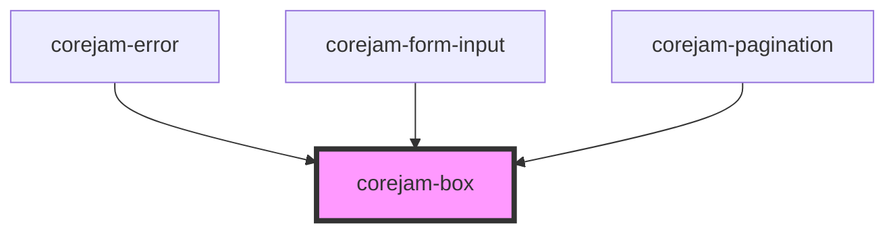

# dershop-ui-box

<!-- Auto Generated Below -->

## Properties

| Property            | Attribute          | Description | Type                                                                | Default                                 |
| ------------------- | ------------------ | ----------- | ------------------------------------------------------------------- | --------------------------------------- |
| `alignContent`      | `align-content`    |             | `"around" \| "between" \| "center" \| "end" \| "start"`             | `undefined`                             |
| `alignContentLg`    | `align-content-lg` |             | `"around" \| "between" \| "center" \| "end" \| "start"`             | `undefined`                             |
| `alignContentMd`    | `align-content-md` |             | `"around" \| "between" \| "center" \| "end" \| "start"`             | `undefined`                             |
| `alignContentSm`    | `align-content-sm` |             | `"around" \| "between" \| "center" \| "end" \| "start"`             | `undefined`                             |
| `alignContentXl`    | `align-content-xl` |             | `"around" \| "between" \| "center" \| "end" \| "start"`             | `undefined`                             |
| `animation`         | `animation`        |             | `string`                                                            | `undefined`                             |
| `bColor`            | `b-color`          |             | `string`                                                            | `undefined`                             |
| `bStyle`            | `b-style`          |             | `string`                                                            | `undefined`                             |
| `bWidth`            | `b-width`          |             | `string`                                                            | `undefined`                             |
| `bWidthBottom`      | `b-width-bottom`   |             | `string`                                                            | `undefined`                             |
| `basis`             | `basis`            |             | `number`                                                            | `undefined`                             |
| `basisLg`           | `basis-lg`         |             | `number`                                                            | `undefined`                             |
| `basisMd`           | `basis-md`         |             | `number`                                                            | `undefined`                             |
| `basisSm`           | `basis-sm`         |             | `number`                                                            | `undefined`                             |
| `basisXl`           | `basis-xl`         |             | `number`                                                            | `undefined`                             |
| `bg`                | `bg`               |             | `string`                                                            | `undefined`                             |
| `bgLg`              | `bg-lg`            |             | `string`                                                            | `undefined`                             |
| `bgMd`              | `bg-md`            |             | `string`                                                            | `undefined`                             |
| `bgSm`              | `bg-sm`            |             | `string`                                                            | `undefined`                             |
| `bgXl`              | `bg-xl`            |             | `string`                                                            | `undefined`                             |
| `bottom`            | `bottom`           |             | `number`                                                            | `undefined`                             |
| `collapse`          | `collapse`         |             | `"collapse" \| "separate"`                                          | `undefined`                             |
| `direction`         | `direction`        |             | `"col" \| "col-reverse" \| "row" \| "row-reverse"`                  | `undefined`                             |
| `directionLg`       | `direction-lg`     |             | `"col" \| "col-reverse" \| "row" \| "row-reverse"`                  | `undefined`                             |
| `directionMd`       | `direction-md`     |             | `"col" \| "col-reverse" \| "row" \| "row-reverse"`                  | `undefined`                             |
| `directionSm`       | `direction-sm`     |             | `"col" \| "col-reverse" \| "row" \| "row-reverse"`                  | `undefined`                             |
| `directionXl`       | `direction-xl`     |             | `"col" \| "col-reverse" \| "row" \| "row-reverse"`                  | `undefined`                             |
| `droppableElements` | --                 |             | `string[]`                                                          | `["dershop-ui-box", "dershop-ui-grid"]` |
| `flex`              | `flex`             |             | `boolean`                                                           | `undefined`                             |
| `flow`              | `flow`             |             | `"column" \| "column-reverse" \| "row" \| "row-reverse"`            | `undefined`                             |
| `flowLg`            | `flow-lg`          |             | `"column" \| "column-reverse" \| "row" \| "row-reverse"`            | `undefined`                             |
| `flowMd`            | `flow-md`          |             | `"column" \| "column-reverse" \| "row" \| "row-reverse"`            | `undefined`                             |
| `flowSm`            | `flow-sm`          |             | `"column" \| "column-reverse" \| "row" \| "row-reverse"`            | `undefined`                             |
| `flowXl`            | `flow-xl`          |             | `"column" \| "column-reverse" \| "row" \| "row-reverse"`            | `undefined`                             |
| `grow`              | `grow`             |             | `number`                                                            | `undefined`                             |
| `growLg`            | `grow-lg`          |             | `number`                                                            | `undefined`                             |
| `growMd`            | `grow-md`          |             | `number`                                                            | `undefined`                             |
| `growSm`            | `grow-sm`          |             | `number`                                                            | `undefined`                             |
| `growXl`            | `grow-xl`          |             | `number`                                                            | `undefined`                             |
| `h`                 | `h`                |             | `string`                                                            | `undefined`                             |
| `hLg`               | `h-lg`             |             | `string`                                                            | `undefined`                             |
| `hMd`               | `h-md`             |             | `string`                                                            | `undefined`                             |
| `hSm`               | `h-sm`             |             | `string`                                                            | `undefined`                             |
| `hXl`               | `h-xl`             |             | `string`                                                            | `undefined`                             |
| `hiddenXl`          | `hidden-xl`        |             | `boolean`                                                           | `undefined`                             |
| `hide`              | `hide`             |             | `string`                                                            | `undefined`                             |
| `hideLg`            | `hide-lg`          |             | `string`                                                            | `undefined`                             |
| `hideMd`            | `hide-md`          |             | `string`                                                            | `undefined`                             |
| `hideSm`            | `hide-sm`          |             | `string`                                                            | `undefined`                             |
| `items`             | `items`            |             | `"baseline" \| "center" \| "end" \| "start" \| "stretch"`           | `undefined`                             |
| `itemsLg`           | `items-lg`         |             | `"baseline" \| "center" \| "end" \| "start" \| "stretch"`           | `undefined`                             |
| `itemsMd`           | `items-md`         |             | `"baseline" \| "center" \| "end" \| "start" \| "stretch"`           | `undefined`                             |
| `itemsSm`           | `items-sm`         |             | `"baseline" \| "center" \| "end" \| "start" \| "stretch"`           | `undefined`                             |
| `itemsXl`           | `items-xl`         |             | `"baseline" \| "center" \| "end" \| "start" \| "stretch"`           | `undefined`                             |
| `justify`           | `justify`          |             | `"around" \| "between" \| "center" \| "end" \| "evenly" \| "start"` | `undefined`                             |
| `justifyLg`         | `justify-lg`       |             | `"around" \| "between" \| "center" \| "end" \| "evenly" \| "start"` | `undefined`                             |
| `justifyMd`         | `justify-md`       |             | `"around" \| "between" \| "center" \| "end" \| "evenly" \| "start"` | `undefined`                             |
| `justifySm`         | `justify-sm`       |             | `"around" \| "between" \| "center" \| "end" \| "evenly" \| "start"` | `undefined`                             |
| `justifyXl`         | `justify-xl`       |             | `"around" \| "between" \| "center" \| "end" \| "evenly" \| "start"` | `undefined`                             |
| `left`              | `left`             |             | `number`                                                            | `undefined`                             |
| `m`                 | `m`                |             | `string`                                                            | `undefined`                             |
| `mLg`               | `m-lg`             |             | `string`                                                            | `undefined`                             |
| `mMd`               | `m-md`             |             | `string`                                                            | `undefined`                             |
| `mSm`               | `m-sm`             |             | `string`                                                            | `undefined`                             |
| `mXl`               | `m-xl`             |             | `string`                                                            | `undefined`                             |
| `max`               | `max`              |             | `string`                                                            | `undefined`                             |
| `maxLg`             | `max-lg`           |             | `string`                                                            | `undefined`                             |
| `maxMd`             | `max-md`           |             | `string`                                                            | `undefined`                             |
| `maxSm`             | `max-sm`           |             | `string`                                                            | `undefined`                             |
| `maxXl`             | `max-xl`           |             | `string`                                                            | `undefined`                             |
| `mb`                | `mb`               |             | `string`                                                            | `undefined`                             |
| `mbLg`              | `mb-lg`            |             | `string`                                                            | `undefined`                             |
| `mbMd`              | `mb-md`            |             | `string`                                                            | `undefined`                             |
| `mbSm`              | `mb-sm`            |             | `string`                                                            | `undefined`                             |
| `mbXl`              | `mb-xl`            |             | `string`                                                            | `undefined`                             |
| `ml`                | `ml`               |             | `string`                                                            | `undefined`                             |
| `mlLg`              | `ml-lg`            |             | `string`                                                            | `undefined`                             |
| `mlMd`              | `ml-md`            |             | `string`                                                            | `undefined`                             |
| `mlSm`              | `ml-sm`            |             | `string`                                                            | `undefined`                             |
| `mlXl`              | `ml-xl`            |             | `string`                                                            | `undefined`                             |
| `mr`                | `mr`               |             | `string`                                                            | `undefined`                             |
| `mrLg`              | `mr-lg`            |             | `string`                                                            | `undefined`                             |
| `mrMd`              | `mr-md`            |             | `string`                                                            | `undefined`                             |
| `mrSm`              | `mr-sm`            |             | `string`                                                            | `undefined`                             |
| `mrXl`              | `mr-xl`            |             | `string`                                                            | `undefined`                             |
| `mt`                | `mt`               |             | `string`                                                            | `undefined`                             |
| `mtLg`              | `mt-lg`            |             | `string`                                                            | `undefined`                             |
| `mtMd`              | `mt-md`            |             | `string`                                                            | `undefined`                             |
| `mtSm`              | `mt-sm`            |             | `string`                                                            | `undefined`                             |
| `mtXl`              | `mt-xl`            |             | `string`                                                            | `undefined`                             |
| `mx`                | `mx`               |             | `string`                                                            | `undefined`                             |
| `mxLg`              | `mx-lg`            |             | `string`                                                            | `undefined`                             |
| `mxMd`              | `mx-md`            |             | `string`                                                            | `undefined`                             |
| `mxSm`              | `mx-sm`            |             | `string`                                                            | `undefined`                             |
| `mxXl`              | `mx-xl`            |             | `string`                                                            | `undefined`                             |
| `my`                | `my`               |             | `string`                                                            | `undefined`                             |
| `myLg`              | `my-lg`            |             | `string`                                                            | `undefined`                             |
| `myMd`              | `my-md`            |             | `string`                                                            | `undefined`                             |
| `mySm`              | `my-sm`            |             | `string`                                                            | `undefined`                             |
| `myXl`              | `my-xl`            |             | `string`                                                            | `undefined`                             |
| `order`             | `order`            |             | `number`                                                            | `undefined`                             |
| `orderLg`           | `order-lg`         |             | `number`                                                            | `undefined`                             |
| `orderMd`           | `order-md`         |             | `number`                                                            | `undefined`                             |
| `orderSm`           | `order-sm`         |             | `number`                                                            | `undefined`                             |
| `orderXl`           | `order-xl`         |             | `number`                                                            | `undefined`                             |
| `p`                 | `p`                |             | `string`                                                            | `undefined`                             |
| `pLg`               | `p-lg`             |             | `string`                                                            | `undefined`                             |
| `pMd`               | `p-md`             |             | `string`                                                            | `undefined`                             |
| `pSm`               | `p-sm`             |             | `string`                                                            | `undefined`                             |
| `pXl`               | `p-xl`             |             | `string`                                                            | `undefined`                             |
| `pb`                | `pb`               |             | `string`                                                            | `undefined`                             |
| `pbLg`              | `pb-lg`            |             | `string`                                                            | `undefined`                             |
| `pbMd`              | `pb-md`            |             | `string`                                                            | `undefined`                             |
| `pbSm`              | `pb-sm`            |             | `string`                                                            | `undefined`                             |
| `pbXl`              | `pb-xl`            |             | `string`                                                            | `undefined`                             |
| `pl`                | `pl`               |             | `string`                                                            | `undefined`                             |
| `plLg`              | `pl-lg`            |             | `string`                                                            | `undefined`                             |
| `plMd`              | `pl-md`            |             | `string`                                                            | `undefined`                             |
| `plSm`              | `pl-sm`            |             | `string`                                                            | `undefined`                             |
| `plXl`              | `pl-xl`            |             | `string`                                                            | `undefined`                             |
| `position`          | `position`         |             | `"absolute" \| "fixed" \| "relative" \| "static" \| "sticky"`       | `undefined`                             |
| `pr`                | `pr`               |             | `string`                                                            | `undefined`                             |
| `prLg`              | `pr-lg`            |             | `string`                                                            | `undefined`                             |
| `prMd`              | `pr-md`            |             | `string`                                                            | `undefined`                             |
| `prSm`              | `pr-sm`            |             | `string`                                                            | `undefined`                             |
| `prXl`              | `pr-xl`            |             | `string`                                                            | `undefined`                             |
| `pt`                | `pt`               |             | `string`                                                            | `undefined`                             |
| `ptLg`              | `pt-lg`            |             | `string`                                                            | `undefined`                             |
| `ptMd`              | `pt-md`            |             | `string`                                                            | `undefined`                             |
| `ptSm`              | `pt-sm`            |             | `string`                                                            | `undefined`                             |
| `ptXl`              | `pt-xl`            |             | `string`                                                            | `undefined`                             |
| `px`                | `px`               |             | `string`                                                            | `undefined`                             |
| `pxLg`              | `px-lg`            |             | `string`                                                            | `undefined`                             |
| `pxMd`              | `px-md`            |             | `string`                                                            | `undefined`                             |
| `pxSm`              | `px-sm`            |             | `string`                                                            | `undefined`                             |
| `pxXl`              | `px-xl`            |             | `string`                                                            | `undefined`                             |
| `py`                | `py`               |             | `string`                                                            | `undefined`                             |
| `pyLg`              | `py-lg`            |             | `string`                                                            | `undefined`                             |
| `pyMd`              | `py-md`            |             | `string`                                                            | `undefined`                             |
| `pySm`              | `py-sm`            |             | `string`                                                            | `undefined`                             |
| `pyXl`              | `py-xl`            |             | `string`                                                            | `undefined`                             |
| `right`             | `right`            |             | `number`                                                            | `undefined`                             |
| `rounded`           | `rounded`          |             | `string`                                                            | `undefined`                             |
| `roundedBottom`     | `rounded-bottom`   |             | `string`                                                            | `undefined`                             |
| `roundedLeft`       | `rounded-left`     |             | `string`                                                            | `undefined`                             |
| `roundedRight`      | `rounded-right`    |             | `string`                                                            | `undefined`                             |
| `roundedTop`        | `rounded-top`      |             | `string`                                                            | `undefined`                             |
| `self`              | `self`             |             | `"auto" \| "center" \| "end" \| "start" \| "stretch"`               | `undefined`                             |
| `selfLg`            | `self-lg`          |             | `"auto" \| "center" \| "end" \| "start" \| "stretch"`               | `undefined`                             |
| `selfMd`            | `self-md`          |             | `"auto" \| "center" \| "end" \| "start" \| "stretch"`               | `undefined`                             |
| `selfSm`            | `self-sm`          |             | `"auto" \| "center" \| "end" \| "start" \| "stretch"`               | `undefined`                             |
| `selfXl`            | `self-xl`          |             | `"auto" \| "center" \| "end" \| "start" \| "stretch"`               | `undefined`                             |
| `shadow`            | `shadow`           |             | `string`                                                            | `undefined`                             |
| `show`              | `show`             |             | `string`                                                            | `undefined`                             |
| `showLg`            | `show-lg`          |             | `string`                                                            | `undefined`                             |
| `showMd`            | `show-md`          |             | `string`                                                            | `undefined`                             |
| `showSm`            | `show-sm`          |             | `string`                                                            | `undefined`                             |
| `showXl`            | `show-xl`          |             | `string`                                                            | `undefined`                             |
| `shrink`            | `shrink`           |             | `number`                                                            | `undefined`                             |
| `shrinkLg`          | `shrink-lg`        |             | `number`                                                            | `undefined`                             |
| `shrinkMd`          | `shrink-md`        |             | `number`                                                            | `undefined`                             |
| `shrinkSm`          | `shrink-sm`        |             | `number`                                                            | `undefined`                             |
| `shrinkXl`          | `shrink-xl`        |             | `number`                                                            | `undefined`                             |
| `top`               | `top`              |             | `number`                                                            | `undefined`                             |
| `w`                 | `w`                |             | `string`                                                            | `undefined`                             |
| `wLg`               | `w-lg`             |             | `string`                                                            | `undefined`                             |
| `wMd`               | `w-md`             |             | `string`                                                            | `undefined`                             |
| `wSm`               | `w-sm`             |             | `string`                                                            | `undefined`                             |
| `wXl`               | `w-xl`             |             | `string`                                                            | `undefined`                             |
| `wrap`              | `wrap`             |             | `"no-wrap" \| "wrap" \| "wrap-reverse"`                             | `undefined`                             |
| `wrapLg`            | `wrap-lg`          |             | `"no-wrap" \| "wrap" \| "wrap-reverse"`                             | `undefined`                             |
| `wrapMd`            | `wrap-md`          |             | `"no-wrap" \| "wrap" \| "wrap-reverse"`                             | `undefined`                             |
| `wrapSm`            | `wrap-sm`          |             | `"no-wrap" \| "wrap" \| "wrap-reverse"`                             | `undefined`                             |
| `wrapXl`            | `wrap-xl`          |             | `"no-wrap" \| "wrap" \| "wrap-reverse"`                             | `undefined`                             |

## Dependencies

### Used by

 - [corejam-error](../corejam-error)
 - [corejam-form-input](../FormInput)
 - [corejam-pagination](../corejam-pagination)

### Graph

----------------------------------------------

*Built with [StencilJS](https://stenciljs.com/)*
