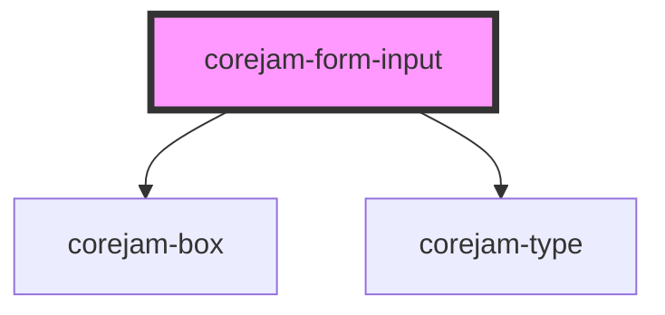

# dershop-form-input

<!-- Auto Generated Below -->

## Properties

| Property       | Attribute      | Description | Type      | Default      |
| -------------- | -------------- | ----------- | --------- | ------------ |
| `autocomplete` | `autocomplete` |             | `string`  | `"off"`      |
| `bg`           | `bg`           |             | `string`  | `"gray-100"` |
| `formId`       | `form-id`      |             | `string`  | `undefined`  |
| `label`        | `label`        |             | `string`  | `undefined`  |
| `name`         | `name`         |             | `string`  | `undefined`  |
| `placeholder`  | `placeholder`  |             | `string`  | `undefined`  |
| `required`     | `required`     |             | `boolean` | `false`      |
| `type`         | `type`         |             | `string`  | `undefined`  |

## Events

| Event       | Description | Type               |
| ----------- | ----------- | ------------------ |
| `formEvent` |             | `CustomEvent<any>` |

## Dependencies

### Depends on

- [corejam-box](../Box)
- [corejam-type](../Type)

### Graph

----------------------------------------------

*Built with [StencilJS](https://stenciljs.com/)*
