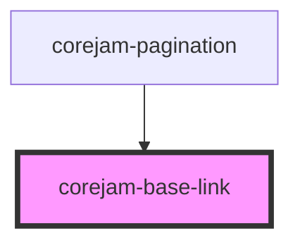

# dershop-base-link

<!-- Auto Generated Below -->

## Properties

| Property | Attribute | Description | Type      | Default     |
| -------- | --------- | ----------- | --------- | ----------- |
| `full`   | `full`    |             | `boolean` | `false`     |
| `hidden` | `hidden`  |             | `boolean` | `undefined` |
| `href`   | `href`    |             | `string`  | `undefined` |
| `m`      | `m`       |             | `string`  | `undefined` |
| `mb`     | `mb`      |             | `string`  | `undefined` |
| `ml`     | `ml`      |             | `string`  | `undefined` |
| `mr`     | `mr`      |             | `string`  | `undefined` |
| `mt`     | `mt`      |             | `string`  | `undefined` |
| `mx`     | `mx`      |             | `string`  | `undefined` |
| `my`     | `my`      |             | `string`  | `undefined` |
| `show`   | `show`    |             | `string`  | `undefined` |

## Dependencies

### Used by

 - [corejam-pagination](../corejam-pagination)

### Graph

----------------------------------------------

*Built with [StencilJS](https://stenciljs.com/)*
