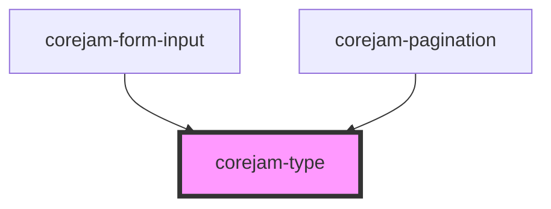

# corejam-type

<!-- Auto Generated Below -->

## Properties

| Property            | Attribute    | Description | Type                                                                                             | Default                                 |
| ------------------- | ------------ | ----------- | ------------------------------------------------------------------------------------------------ | --------------------------------------- |
| `align`             | `align`      |             | `"center" \| "left" \| "right"`                                                                  | `undefined`                             |
| `as`                | `as`         |             | `string`                                                                                         | `"span"`                                |
| `color`             | `color`      |             | `string`                                                                                         | `undefined`                             |
| `decoration`        | `decoration` |             | `"line-through" \| "no-underline" \| "underline"`                                                | `undefined`                             |
| `droppableElements` | --           |             | `string[]`                                                                                       | `["dershop-ui-box", "dershop-ui-grid"]` |
| `family`            | `family`     |             | `"mono" \| "sans" \| "serif"`                                                                    | `undefined`                             |
| `fontStyle`         | `font-style` |             | `"italic" \| "not-italic"`                                                                       | `undefined`                             |
| `p`                 | `p`          |             | `1 \| 10 \| 12 \| 16 \| 2 \| 3 \| 32 \| 4 \| 5 \| 6 \| 64 \| 8`                                  | `undefined`                             |
| `pLg`               | `p-lg`       |             | `1 \| 10 \| 12 \| 16 \| 2 \| 3 \| 32 \| 4 \| 5 \| 6 \| 64 \| 8`                                  | `undefined`                             |
| `pMd`               | `p-md`       |             | `1 \| 10 \| 12 \| 16 \| 2 \| 3 \| 32 \| 4 \| 5 \| 6 \| 64 \| 8`                                  | `undefined`                             |
| `pSm`               | `p-sm`       |             | `1 \| 10 \| 12 \| 16 \| 2 \| 3 \| 32 \| 4 \| 5 \| 6 \| 64 \| 8`                                  | `undefined`                             |
| `pXl`               | `p-xl`       |             | `1 \| 10 \| 12 \| 16 \| 2 \| 3 \| 32 \| 4 \| 5 \| 6 \| 64 \| 8`                                  | `undefined`                             |
| `pb`                | `pb`         |             | `1 \| 10 \| 12 \| 16 \| 2 \| 3 \| 32 \| 4 \| 5 \| 6 \| 64 \| 8`                                  | `undefined`                             |
| `pbLg`              | `pb-lg`      |             | `1 \| 10 \| 12 \| 16 \| 2 \| 3 \| 32 \| 4 \| 5 \| 6 \| 64 \| 8`                                  | `undefined`                             |
| `pbMd`              | `pb-md`      |             | `1 \| 10 \| 12 \| 16 \| 2 \| 3 \| 32 \| 4 \| 5 \| 6 \| 64 \| 8`                                  | `undefined`                             |
| `pbSm`              | `pb-sm`      |             | `1 \| 10 \| 12 \| 16 \| 2 \| 3 \| 32 \| 4 \| 5 \| 6 \| 64 \| 8`                                  | `undefined`                             |
| `pbXl`              | `pb-xl`      |             | `1 \| 10 \| 12 \| 16 \| 2 \| 3 \| 32 \| 4 \| 5 \| 6 \| 64 \| 8`                                  | `undefined`                             |
| `pl`                | `pl`         |             | `1 \| 10 \| 12 \| 16 \| 2 \| 3 \| 32 \| 4 \| 5 \| 6 \| 64 \| 8`                                  | `undefined`                             |
| `plLg`              | `pl-lg`      |             | `1 \| 10 \| 12 \| 16 \| 2 \| 3 \| 32 \| 4 \| 5 \| 6 \| 64 \| 8`                                  | `undefined`                             |
| `plMd`              | `pl-md`      |             | `1 \| 10 \| 12 \| 16 \| 2 \| 3 \| 32 \| 4 \| 5 \| 6 \| 64 \| 8`                                  | `undefined`                             |
| `plSm`              | `pl-sm`      |             | `1 \| 10 \| 12 \| 16 \| 2 \| 3 \| 32 \| 4 \| 5 \| 6 \| 64 \| 8`                                  | `undefined`                             |
| `plXl`              | `pl-xl`      |             | `1 \| 10 \| 12 \| 16 \| 2 \| 3 \| 32 \| 4 \| 5 \| 6 \| 64 \| 8`                                  | `undefined`                             |
| `pr`                | `pr`         |             | `1 \| 10 \| 12 \| 16 \| 2 \| 3 \| 32 \| 4 \| 5 \| 6 \| 64 \| 8`                                  | `undefined`                             |
| `prLg`              | `pr-lg`      |             | `1 \| 10 \| 12 \| 16 \| 2 \| 3 \| 32 \| 4 \| 5 \| 6 \| 64 \| 8`                                  | `undefined`                             |
| `prMd`              | `pr-md`      |             | `1 \| 10 \| 12 \| 16 \| 2 \| 3 \| 32 \| 4 \| 5 \| 6 \| 64 \| 8`                                  | `undefined`                             |
| `prSm`              | `pr-sm`      |             | `1 \| 10 \| 12 \| 16 \| 2 \| 3 \| 32 \| 4 \| 5 \| 6 \| 64 \| 8`                                  | `undefined`                             |
| `prXl`              | `pr-xl`      |             | `1 \| 10 \| 12 \| 16 \| 2 \| 3 \| 32 \| 4 \| 5 \| 6 \| 64 \| 8`                                  | `undefined`                             |
| `pt`                | `pt`         |             | `1 \| 10 \| 12 \| 16 \| 2 \| 3 \| 32 \| 4 \| 5 \| 6 \| 64 \| 8`                                  | `undefined`                             |
| `ptLg`              | `pt-lg`      |             | `1 \| 10 \| 12 \| 16 \| 2 \| 3 \| 32 \| 4 \| 5 \| 6 \| 64 \| 8`                                  | `undefined`                             |
| `ptMd`              | `pt-md`      |             | `1 \| 10 \| 12 \| 16 \| 2 \| 3 \| 32 \| 4 \| 5 \| 6 \| 64 \| 8`                                  | `undefined`                             |
| `ptSm`              | `pt-sm`      |             | `1 \| 10 \| 12 \| 16 \| 2 \| 3 \| 32 \| 4 \| 5 \| 6 \| 64 \| 8`                                  | `undefined`                             |
| `ptXl`              | `pt-xl`      |             | `1 \| 10 \| 12 \| 16 \| 2 \| 3 \| 32 \| 4 \| 5 \| 6 \| 64 \| 8`                                  | `undefined`                             |
| `px`                | `px`         |             | `1 \| 10 \| 12 \| 16 \| 2 \| 3 \| 32 \| 4 \| 5 \| 6 \| 64 \| 8`                                  | `undefined`                             |
| `pxLg`              | `px-lg`      |             | `1 \| 10 \| 12 \| 16 \| 2 \| 3 \| 32 \| 4 \| 5 \| 6 \| 64 \| 8`                                  | `undefined`                             |
| `pxMd`              | `px-md`      |             | `1 \| 10 \| 12 \| 16 \| 2 \| 3 \| 32 \| 4 \| 5 \| 6 \| 64 \| 8`                                  | `undefined`                             |
| `pxSm`              | `px-sm`      |             | `1 \| 10 \| 12 \| 16 \| 2 \| 3 \| 32 \| 4 \| 5 \| 6 \| 64 \| 8`                                  | `undefined`                             |
| `pxXl`              | `px-xl`      |             | `1 \| 10 \| 12 \| 16 \| 2 \| 3 \| 32 \| 4 \| 5 \| 6 \| 64 \| 8`                                  | `undefined`                             |
| `py`                | `py`         |             | `1 \| 10 \| 12 \| 16 \| 2 \| 3 \| 32 \| 4 \| 5 \| 6 \| 64 \| 8`                                  | `undefined`                             |
| `pyLg`              | `py-lg`      |             | `1 \| 10 \| 12 \| 16 \| 2 \| 3 \| 32 \| 4 \| 5 \| 6 \| 64 \| 8`                                  | `undefined`                             |
| `pyMd`              | `py-md`      |             | `1 \| 10 \| 12 \| 16 \| 2 \| 3 \| 32 \| 4 \| 5 \| 6 \| 64 \| 8`                                  | `undefined`                             |
| `pySm`              | `py-sm`      |             | `1 \| 10 \| 12 \| 16 \| 2 \| 3 \| 32 \| 4 \| 5 \| 6 \| 64 \| 8`                                  | `undefined`                             |
| `pyXl`              | `py-xl`      |             | `1 \| 10 \| 12 \| 16 \| 2 \| 3 \| 32 \| 4 \| 5 \| 6 \| 64 \| 8`                                  | `undefined`                             |
| `size`              | `size`       |             | `"2xl" \| "3xl" \| "4xl" \| "5xl" \| "6xl" \| "base" \| "lg" \| "sm" \| "xl" \| "xs"`            | `undefined`                             |
| `smooth`            | `smooth`     |             | `"antialiased" \| "subpixel-antialiased"`                                                        | `undefined`                             |
| `spacing`           | `spacing`    |             | `"normal" \| "tight" \| "tighter" \| "wide" \| "wider" \| "widest"`                              | `undefined`                             |
| `transform`         | `transform`  |             | `"capitalize" \| "lowercase" \| "normal-case" \| "uppercase"`                                    | `undefined`                             |
| `weight`            | `weight`     |             | `"black" \| "bold" \| "extrabold" \| "hairline" \| "medium" \| "normal" \| "semibold" \| "thin"` | `undefined`                             |

## Dependencies

### Used by

 - [corejam-form-input](../FormInput)
 - [corejam-pagination](../corejam-pagination)

### Graph

----------------------------------------------

*Built with [StencilJS](https://stenciljs.com/)*
