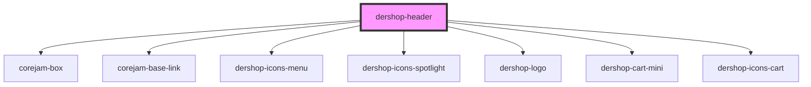

# dershop-header

<!-- Auto Generated Below -->

## Properties

| Property         | Attribute         | Description | Type     | Default     |
| ---------------- | ----------------- | ----------- | -------- | ----------- |
| `cartLink`       | `cart-link`       |             | `string` | `"/cart/"`  |
| `mainLinks`      | `main-links`      |             | `any`    | `undefined` |
| `maxScreen`      | `max-screen`      |             | `string` | `"xl"`      |
| `secondaryLinks` | `secondary-links` |             | `any`    | `undefined` |
| `xAlign`         | `x-align`         |             | `string` | `"auto"`    |

## Dependencies

### Depends on

- corejam-box
- corejam-base-link
- [dershop-icons-menu](../icons/icons-menu)
- [dershop-icons-spotlight](../icons/icons-spotlight)
- [dershop-logo](../icons/logo)
- [dershop-cart-mini](../dershop-cart-mini)
- [dershop-icons-cart](../icons/icons-cart)

### Graph

----------------------------------------------

*Built with [StencilJS](https://stenciljs.com/)*
