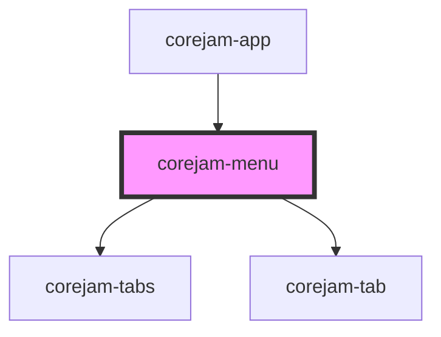

# corejam-menu

<!-- Auto Generated Below -->

## Properties

| Property | Attribute | Description | Type      | Default |
| -------- | --------- | ----------- | --------- | ------- |
| `demo`   | `demo`    |             | `boolean` | `false` |

## Events

| Event             | Description | Type               |
| ----------------- | ----------- | ------------------ |
| `hideCorejamMenu` |             | `CustomEvent<any>` |
| `showCorejamMenu` |             | `CustomEvent<any>` |

## Methods

### `addTab(tab: any) => Promise<unknown>`

Add tab via public component method

#### Returns

Type: `Promise<unknown>`

## Dependencies

### Used by

 - [corejam-app](../App)

### Depends on

- [corejam-tabs](../tabs)
- [corejam-tab](../tabs)

### Graph

----------------------------------------------

*Built with [StencilJS](https://stenciljs.com/)*
